# Fractal Basins of the Three-Body Problem

<p align="center">
  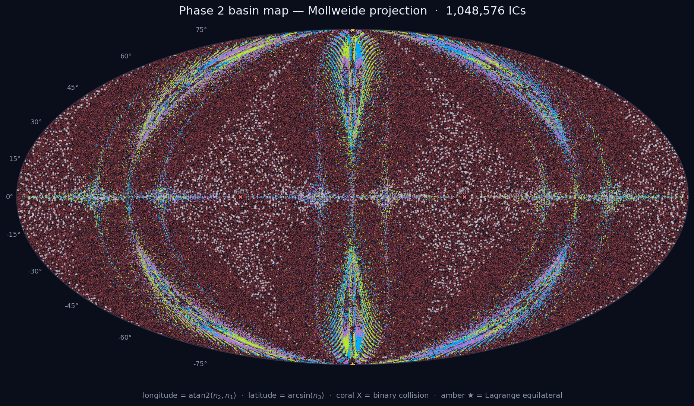
</p>

> Three stars pull on each other. One eventually gets flung out. *Which one?* The answer depends on the starting positions with infinite sensitivity. This project maps that sensitivity, measures it, and asks whether a 40-year-old physics prediction about it holds up when tested with modern machine learning.

**Author:** Aishwarya Das, [Dirac Labs Inc.](https://diraclabs.com)

---

## What is the Three-Body Problem?

Take three objects of equal mass, place them somewhere on a plane, and let gravity do its work. Unlike two objects (which orbit each other in clean ellipses), three objects produce chaotic motion. Their trajectories are wildly sensitive to initial conditions: nudge a starting position by a billionth of a percent, and a completely different object might get ejected.

The **escape basins** are the regions of starting positions that lead to each outcome (body 1 escapes, body 2 escapes, body 3 escapes, or all three remain bound). The boundaries between these regions are **fractal**: they have infinitely complex, self-similar structure at every scale. No matter how closely you zoom in, the boundary never becomes a clean line.

Even more remarkably, these boundaries satisfy the **Wada property**: every single point on any boundary simultaneously touches *all three* escape basins. There is no boundary that separates just two outcomes. Every edge is a three-way junction, all the way down.

<p align="center">
  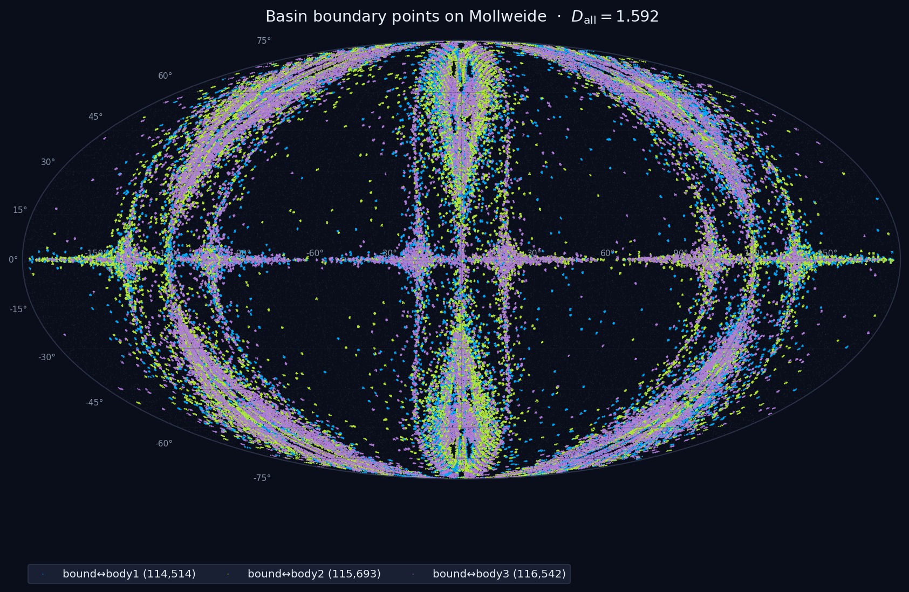
</p>
<p align="center"><em>The fractal basin boundaries. Each color marks where two specific basins meet. All three colors overlap everywhere, confirming the Wada property. The fractal dimension of this boundary is D = 1.59.</em></p>

---

## The Shape Sphere

To study three-body configurations, we use a mathematical tool called the **Montgomery shape sphere**. It strips away everything irrelevant (where the center of mass is, how the system is rotated, how big it is) and keeps only the *shape* of the triangle formed by the three bodies. Every possible triangle shape maps to a point on a sphere.

On this sphere, special configurations have special positions:
- The three **collision points** (where two bodies are on top of each other) sit 120 degrees apart on the equator
- The two **equilateral triangle** configurations (Lagrange points) sit at the north and south poles

<p align="center">
  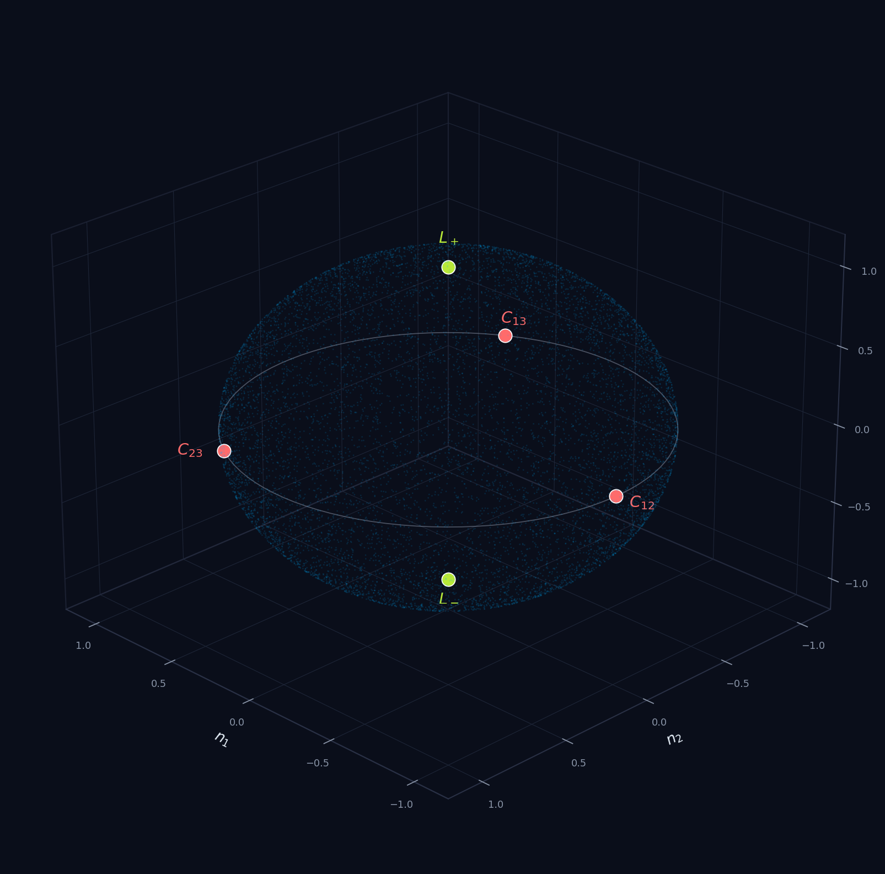
  &nbsp;&nbsp;&nbsp;
  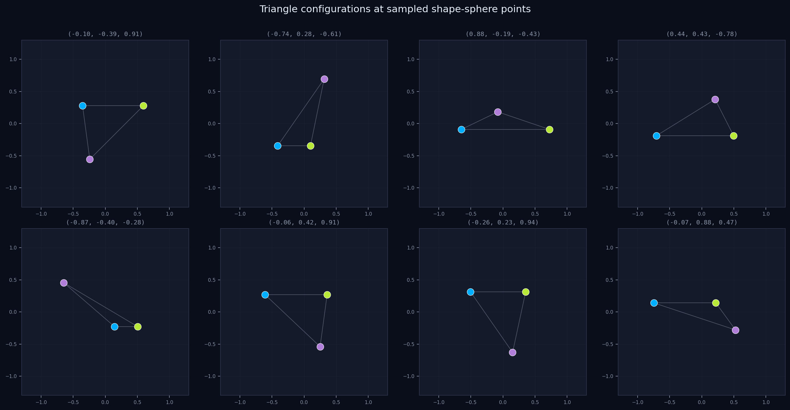
</p>
<p align="center"><em>Left: The shape sphere. C<sub>12</sub>, C<sub>13</sub>, C<sub>23</sub> are collision points; L<sub>+</sub>, L<sub>-</sub> are equilateral configurations. Right: What the actual three-body triangles look like at different points on the sphere.</em></p>

---

## The Dataset

We simulated **one million** three-body trajectories, starting from random points on the shape sphere with zero initial velocity. Each trajectory was integrated forward in time using a high-precision symplectic integrator until the outcome (escape or bound) was determined.

After removing trajectories that passed too close to a collision (where the physics becomes numerically unreliable), we were left with:

| Dataset | Clean trajectories | Dimensions | Close-encounter exclusion |
|---|---|---|---|
| 2D at rest | 953,143 | 3 (shape sphere coordinates) | 9.1% removed |
| 6D phase space | 1,010,567 | 7 (shape + momenta) | 3.4% removed |

About 94% of the 2D trajectories remain permanently bound. The escape trajectories are the interesting minority.

We also measured two key quantities that characterize the fractal structure:

**The uncertainty exponent (alpha):** How quickly does the "confused zone" shrink as you zoom in? We measured alpha = 0.259 in 2D and alpha = 0.145 in 6D. These numbers govern how hard the classification problem is.

**The uncertainty dimension (D_u):** How much of the space is "near" a basin boundary? In 2D, D_u = 1.74 out of 2 dimensions, so the boundary is a thick fractal thread. In 6D, D_u = 5.86 out of 6 dimensions, meaning the boundary almost fills the entire space. This difference turns out to be the key to everything that follows.

<p align="center">
  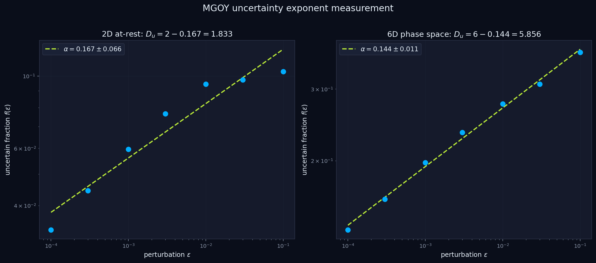
</p>
<p align="center"><em>Measuring the uncertainty exponent. We perturb initial conditions by a tiny amount epsilon and count how often the outcome changes. The power-law slope gives alpha. Both fits have R<sup>2</sup> > 0.99.</em></p>

<p align="center">
  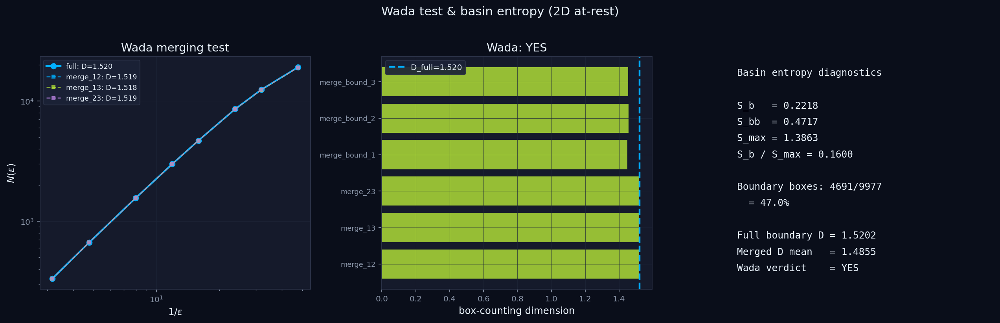
</p>
<p align="center"><em>Wada basin test and entropy measurements. The merging test confirms all three escape basins share a single fractal boundary (Wada: YES). Basin entropy S<sub>b</sub> = 0.222.</em></p>

---

## Can Smart Sampling Beat Random Sampling?

When training a classifier on this data, you have a budget of trajectories you can simulate. Should you pick starting points randomly, or should you focus on the confusing regions near basin boundaries? This is the **active learning** question.

The answer depends on the dimensionality:

- **In 2D:** Active learning improves accuracy by **+3.7%** over random sampling. The basin boundaries are localized fractal threads, so it pays to concentrate your budget near them.
- **In 6D:** Active learning actually **hurts** by -0.7%. The boundaries almost fill the entire space (D_u = 5.86 out of 6 dimensions), so "targeting the boundary" is nearly the same as sampling randomly, but with extra overhead.

<p align="center">
  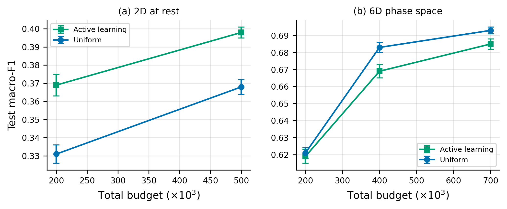
</p>
<p align="center"><em>Active learning (green) vs uniform random sampling (blue). In 2D (left), active learning pulls ahead at every budget. In 6D (right), random sampling wins.</em></p>

**The takeaway:** Active learning strategies that target uncertain regions fail when uncertainty is everywhere. In high-dimensional chaotic systems, the fractal boundary can be so thick that there is no "clean" region to skip.

---

## The Scaling Law: A 40-Year-Old Prediction

In 1983, Grebogi, Ott, and Yorke (GOY) made a prediction: if you train a classifier on N data points in d dimensions, and the system has uncertainty exponent alpha, then the classification error should decrease as:

> error(N) ~ N<sup>-alpha/d</sup>

For our 2D dataset (alpha = 0.259, d = 2), this predicts a log-log slope of **-0.130**. Does it hold?

### When each model trains in its own way: Yes

We trained two neural networks (a standard MLP and an equivariant S3BodyNet) with training schedules tuned for each architecture. The measured slopes were:

| Architecture | Measured slope | GOY prediction | Match |
|---|---|---|---|
| MLP | -0.131 +/- 0.005 | -0.130 | 99% |
| S3BodyNet | -0.141 +/- 0.009 | -0.130 | 92% |

Both are within the statistical uncertainty of the 1983 prediction. Promising.

### When both models train identically: No

But there is a catch. The MLP was trained for 60 epochs and S3BodyNet for 200 epochs. Are we measuring a property of the data, or a property of the training recipe?

To find out, we ran a **pre-registered experiment** where both architectures trained under exactly the same protocol: same optimizer, same learning rate, same total number of gradient updates, same everything. The results:

| Architecture | Measured slope | GOY prediction | Match |
|---|---|---|---|
| MLP | -0.002 +/- 0.003 | -0.130 | No |
| S3BodyNet | +0.014 +/- 0.002 | -0.130 | No |

The slopes are essentially flat. The error barely changes with dataset size. What went wrong?

<p align="center">
  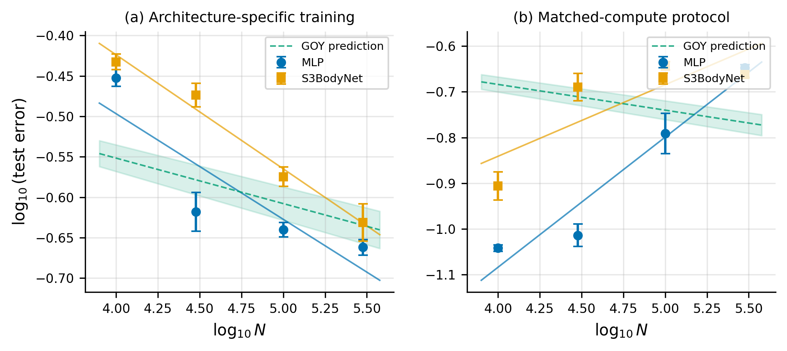
</p>
<p align="center"><em>The core finding. Left: When each model trains with its own schedule, slopes match the GOY prediction (green band). Right: When both models train identically, slopes are flat. Same data, same models, different training protocols, completely different scaling behavior.</em></p>

### The diagnosis: Differential convergence

The fixed training budget (58,594 gradient updates per run) creates an asymmetry. With a small dataset (10k points), the model cycles through the data ~6,000 times and memorizes it. With a large dataset (300k points), the model gets only ~200 passes and never finishes learning.

We re-ran four key configurations with detailed training logs to confirm:

<p align="center">
  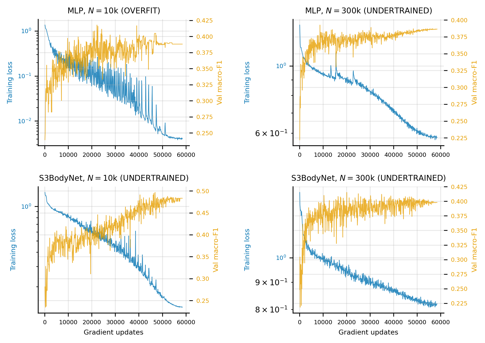
</p>
<p align="center"><em>Training diagnostics. Blue: training loss. Orange: validation score. Top-left: MLP at N=10k overfits (loss near zero, validation declining). Top-right: MLP at N=300k is undertrained (loss still dropping at the end). The same pattern holds for S3BodyNet (bottom row), even more severely.</em></p>

**Small datasets overfit. Large datasets undertrain. Both inflate the error, making the slope look flat.**

### The open question

The per-model-schedule results are consistent with the GOY prediction, but they confound the model with the schedule. The matched-protocol results are clean but the protocol did not achieve equal convergence. Whether the GOY scaling law holds under a truly fair test remains an open question.

---

## Integrator Validation

We used a 6th-order Yoshida symplectic integrator, validated on the famous Chenciner-Montgomery figure-eight orbit, a special solution where all three bodies chase each other along a figure-eight path.

<p align="center">
  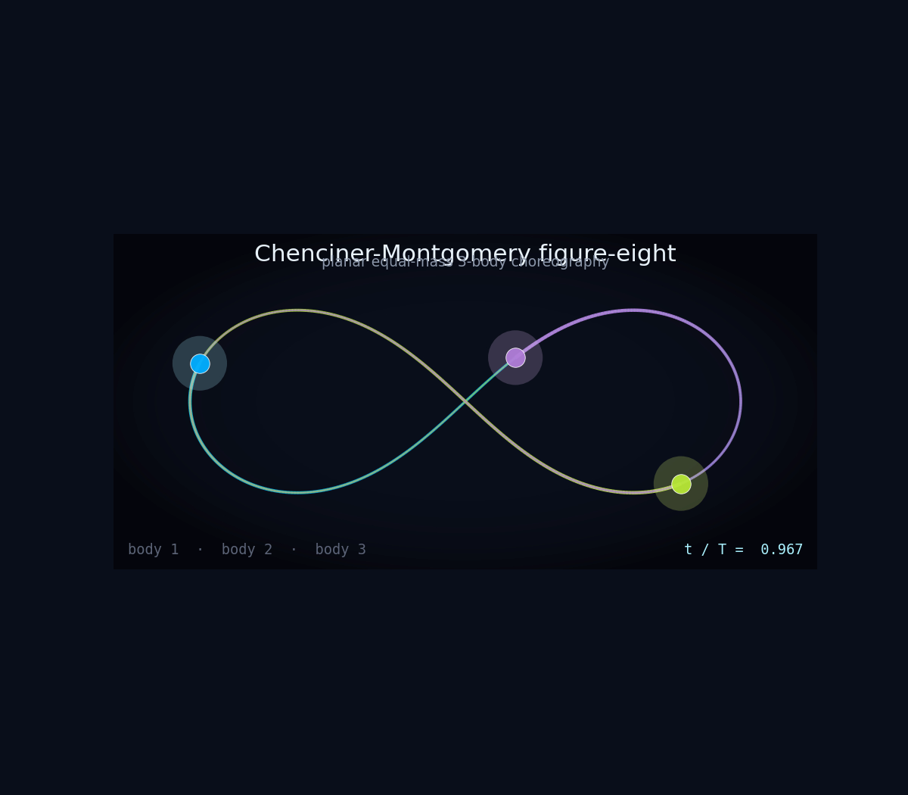
  &nbsp;&nbsp;&nbsp;
  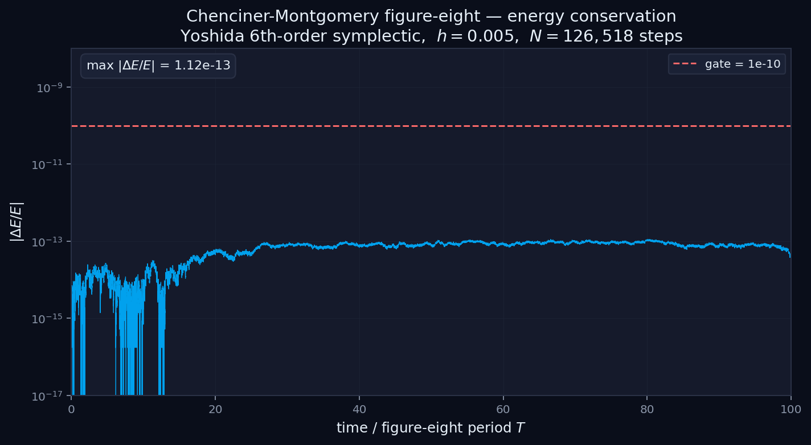
</p>
<p align="center"><em>Left: The figure-eight periodic orbit. Right: Energy conservation stays below 10<sup>-12</sup> over 100 orbital periods, confirming integrator accuracy.</em></p>

---

## Architecture Comparison

We tested four neural network variants at N = 300k and N = 1M:

<p align="center">
  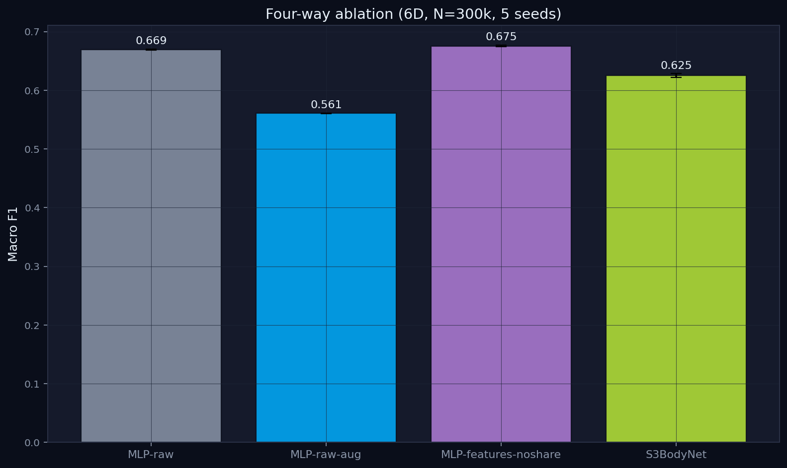
</p>
<p align="center"><em>Four-way architecture ablation at N=300k. MLP-features-noshare performs best. S<sub>3</sub> data augmentation hurts rather than helps, because the data is already symmetric.</em></p>

| Architecture | What it does | Macro-F1 at N=1M |
|---|---|---|
| **MLP-raw** | Standard neural net, raw coordinates | 0.699 |
| **MLP-features-noshare** | Standard neural net, hand-crafted physics features | 0.700 |
| **S3BodyNet** | Equivariant architecture with shared weights | 0.646 |
| **MLP + augmentation** | Standard neural net + symmetry augmentation | 0.574 |

The equivariant architecture (S3BodyNet) does *not* outperform the simple MLP. Data augmentation by the symmetry group actively *hurts* performance, because the data is already symmetric: the augmented copies carry no new information but force the network to spread its capacity across redundant patterns.

---

## Conclusions

1. **The three-body problem produces a natural ML benchmark** with fractal basin boundaries, Wada topology, and measurable scaling exponents. We release ~2 million labeled trajectories.

2. **Active learning helps in low dimensions but fails in high dimensions.** When the fractal boundary fills the space (D_u close to d), targeted sampling offers no advantage over random sampling.

3. **The GOY scaling prediction from 1983 is neither confirmed nor refuted.** It appears to hold when each model is trained optimally, but this confounds the model with its training schedule. A fair matched-protocol test produced flat slopes, but the protocol itself caused differential convergence. A properly controlled test remains an open problem.

---

## Repository Structure

```
mega3bp/                        Core Python package (dynamics, integration, ML)
experiments/                    All experiments (01 through 21)
  21_matched_protocol_final/    Pre-registered matched-compute test
results/                        Result artifacts (JSON)
figures/                        All generated figures
paper/                          LaTeX paper + compiled PDF
```

## Tech Stack

**JAX + Equinox** for GPU-accelerated physics simulation and neural network training. **Optax** for optimizers. **Yoshida-6 symplectic integrator** for trajectory computation. **Matplotlib** for all figures.

## Reproducing

```bash
pip install "jax[cuda12]" equinox optax numpy scipy matplotlib

python experiments/01_dataset_regen/run.py          # Generate dataset
python experiments/13_scaling_2d_s3bodynet/run.py    # Scaling law experiment
python experiments/21_matched_protocol_final/lr_tuning.py   # Matched-compute test
python experiments/21_matched_protocol_final/run_sweep.py
python experiments/21_matched_protocol_final/fit_and_verdict.py
```

## Citation

```bibtex
@misc{das2026fractalbasins,
  title   = {Fractal-Basin Classification for the Planar Three-Body Problem},
  author  = {Das, Aishwarya},
  year    = {2026},
  url     = {https://github.com/anshu4321/fractal-basins-3bp},
}
```

## License

MIT
