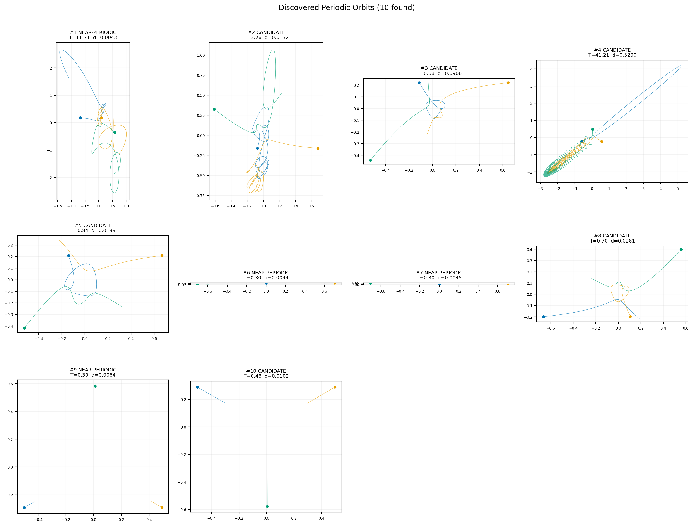
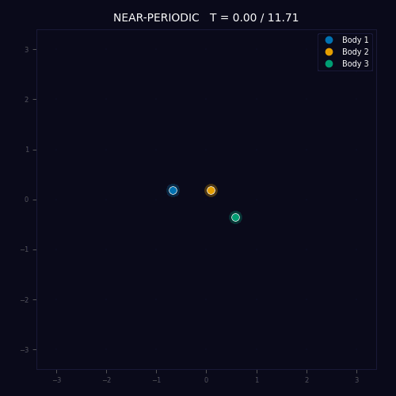
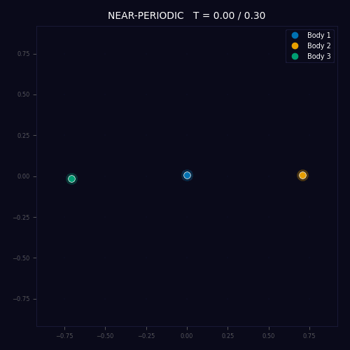
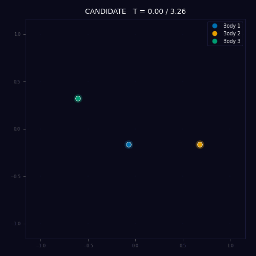
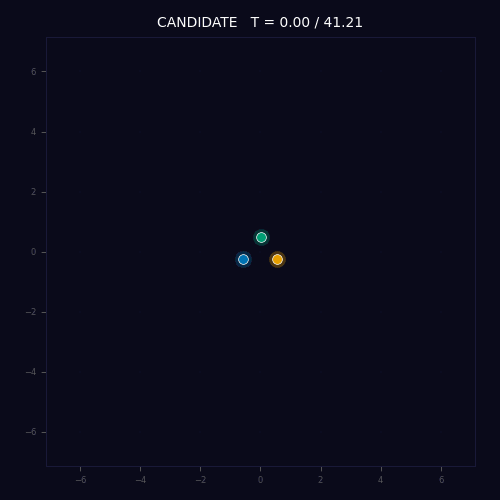

# Fractal Basins of the Three-Body Problem

<p align="center">
  
</p>

> Three stars pull on each other. One eventually gets flung out. *Which one?* The answer depends on the starting positions with infinite sensitivity. This project maps that sensitivity, measures it, and asks whether a 40-year-old physics prediction about it holds up when tested with modern machine learning.

**Author:** Aishwarya Das, [Dirac Labs Inc.](https://diraclabs.com)

---

## What is the Three-Body Problem?

Take three objects of equal mass, place them somewhere on a plane, and let gravity do its work. Unlike two objects (which orbit each other in clean ellipses), three objects produce chaotic motion. Their trajectories are wildly sensitive to initial conditions: nudge a starting position by a billionth of a percent, and a completely different object might get ejected.

The **escape basins** are the regions of starting positions that lead to each outcome (body 1 escapes, body 2 escapes, body 3 escapes, or all three remain bound). The boundaries between these regions are **fractal**: they have infinitely complex, self-similar structure at every scale. No matter how closely you zoom in, the boundary never becomes a clean line.

Even more remarkably, these boundaries satisfy the **Wada property**: every single point on any boundary simultaneously touches *all three* escape basins. There is no boundary that separates just two outcomes. Every edge is a three-way junction, all the way down.

<p align="center">
  
</p>
<p align="center"><em>The fractal basin boundaries. Each color marks where two specific basins meet. All three colors overlap everywhere, confirming the Wada property. The fractal dimension of this boundary is D = 1.59.</em></p>

---

## The Shape Sphere

To study three-body configurations, we use a mathematical tool called the **Montgomery shape sphere**. It strips away everything irrelevant (where the center of mass is, how the system is rotated, how big it is) and keeps only the *shape* of the triangle formed by the three bodies. Every possible triangle shape maps to a point on a sphere.

On this sphere, special configurations have special positions:
- The three **collision points** (where two bodies are on top of each other) sit 120 degrees apart on the equator
- The two **equilateral triangle** configurations (Lagrange points) sit at the north and south poles

<p align="center">
  
  &nbsp;&nbsp;&nbsp;
  
</p>
<p align="center"><em>Left: The shape sphere. C<sub>12</sub>, C<sub>13</sub>, C<sub>23</sub> are collision points; L<sub>+</sub>, L<sub>-</sub> are equilateral configurations. Right: What the actual three-body triangles look like at different points on the sphere.</em></p>

---

## The Dataset

We simulated **one million** three-body trajectories, starting from random points on the shape sphere with zero initial velocity. Each trajectory was integrated forward in time using a high-precision symplectic integrator until the outcome (escape or bound) was determined.

After removing trajectories that passed too close to a collision (where the physics becomes numerically unreliable), we were left with:

| Dataset | Clean trajectories | Dimensions | Close-encounter exclusion |
|---|---|---|---|
| 2D at rest | 953,143 | 3 (shape sphere coordinates) | 9.1% removed |
| 6D phase space | 1,010,567 | 7 (shape + momenta) | 3.4% removed |

About 94% of the 2D trajectories remain permanently bound. The escape trajectories are the interesting minority.

We also measured two key quantities that characterize the fractal structure:

**The uncertainty exponent (alpha):** How quickly does the "confused zone" shrink as you zoom in? We measured alpha = 0.259 in 2D and alpha = 0.145 in 6D. These numbers govern how hard the classification problem is.

**The uncertainty dimension (D_u):** How much of the space is "near" a basin boundary? In 2D, D_u = 1.74 out of 2 dimensions, so the boundary is a thick fractal thread. In 6D, D_u = 5.86 out of 6 dimensions, meaning the boundary almost fills the entire space. This difference turns out to be the key to everything that follows.

<p align="center">
  
</p>
<p align="center"><em>Measuring the uncertainty exponent. We perturb initial conditions by a tiny amount epsilon and count how often the outcome changes. The power-law slope gives alpha. Both fits have R<sup>2</sup> > 0.99.</em></p>

<p align="center">
  
</p>
<p align="center"><em>Wada basin test and entropy measurements. The merging test confirms all three escape basins share a single fractal boundary (Wada: YES). Basin entropy S<sub>b</sub> = 0.222.</em></p>

---

## Can Smart Sampling Beat Random Sampling?

When training a classifier on this data, you have a budget of trajectories you can simulate. Should you pick starting points randomly, or should you focus on the confusing regions near basin boundaries? This is the **active learning** question.

The answer depends on the dimensionality:

- **In 2D:** Active learning improves accuracy by **+3.7%** over random sampling. The basin boundaries are localized fractal threads, so it pays to concentrate your budget near them.
- **In 6D:** Active learning actually **hurts** by -0.7%. The boundaries almost fill the entire space (D_u = 5.86 out of 6 dimensions), so "targeting the boundary" is nearly the same as sampling randomly, but with extra overhead.

<p align="center">
  
</p>
<p align="center"><em>Active learning (green) vs uniform random sampling (blue). In 2D (left), active learning pulls ahead at every budget. In 6D (right), random sampling wins.</em></p>

**The takeaway:** Active learning strategies that target uncertain regions fail when uncertainty is everywhere. In high-dimensional chaotic systems, the fractal boundary can be so thick that there is no "clean" region to skip.

---

## The Scaling Law: A 40-Year-Old Prediction

In 1983, Grebogi, Ott, and Yorke (GOY) made a prediction: if you train a classifier on N data points in d dimensions, and the system has uncertainty exponent alpha, then the classification error should decrease as:

> error(N) ~ N<sup>-alpha/d</sup>

For our 2D dataset (alpha = 0.259, d = 2), this predicts a log-log slope of **-0.130**. Does it hold?

### When each model trains in its own way: Yes

We trained two neural networks (a standard MLP and an equivariant S3BodyNet) with training schedules tuned for each architecture. The measured slopes were:

| Architecture | Measured slope | GOY prediction | Match |
|---|---|---|---|
| MLP | -0.131 +/- 0.005 | -0.130 | 99% |
| S3BodyNet | -0.141 +/- 0.009 | -0.130 | 92% |

Both are within the statistical uncertainty of the 1983 prediction. Promising.

### When both models train identically: No

But there is a catch. The MLP was trained for 60 epochs and S3BodyNet for 200 epochs. Are we measuring a property of the data, or a property of the training recipe?

To find out, we ran a **pre-registered experiment** where both architectures trained under exactly the same protocol: same optimizer, same learning rate, same total number of gradient updates, same everything. The results:

| Architecture | Measured slope | GOY prediction | Match |
|---|---|---|---|
| MLP | -0.002 +/- 0.003 | -0.130 | No |
| S3BodyNet | +0.014 +/- 0.002 | -0.130 | No |

The slopes are essentially flat. The error barely changes with dataset size. What went wrong?

<p align="center">
  
</p>
<p align="center"><em>The core finding. Left: When each model trains with its own schedule, slopes match the GOY prediction (green band). Right: When both models train identically, slopes are flat. Same data, same models, different training protocols, completely different scaling behavior.</em></p>

### The diagnosis: Differential convergence

The fixed training budget (58,594 gradient updates per run) creates an asymmetry. With a small dataset (10k points), the model cycles through the data ~6,000 times and memorizes it. With a large dataset (300k points), the model gets only ~200 passes and never finishes learning.

We re-ran four key configurations with detailed training logs to confirm:

<p align="center">
  
</p>
<p align="center"><em>Training diagnostics. Blue: training loss. Orange: validation score. Top-left: MLP at N=10k overfits (loss near zero, validation declining). Top-right: MLP at N=300k is undertrained (loss still dropping at the end). The same pattern holds for S3BodyNet (bottom row), even more severely.</em></p>

**Small datasets overfit. Large datasets undertrain. Both inflate the error, making the slope look flat.**

### The open question

The per-model-schedule results are consistent with the GOY prediction, but they confound the model with the schedule. The matched-protocol results are clean but the protocol did not achieve equal convergence. Whether the GOY scaling law holds under a truly fair test remains an open question.

---

## Integrator Validation

We used a 6th-order Yoshida symplectic integrator, validated on the famous Chenciner-Montgomery figure-eight orbit, a special solution where all three bodies chase each other along a figure-eight path.

<p align="center">
  
  &nbsp;&nbsp;&nbsp;
  
</p>
<p align="center"><em>Left: The figure-eight periodic orbit. Right: Energy conservation stays below 10<sup>-12</sup> over 100 orbital periods, confirming integrator accuracy.</em></p>

---

## Architecture Comparison

We tested four neural network variants at N = 300k and N = 1M:

<p align="center">
  
</p>
<p align="center"><em>Four-way architecture ablation at N=300k. MLP-features-noshare performs best. S<sub>3</sub> data augmentation hurts rather than helps, because the data is already symmetric.</em></p>

| Architecture | What it does | Macro-F1 at N=1M |
|---|---|---|
| **MLP-raw** | Standard neural net, raw coordinates | 0.699 |
| **MLP-features-noshare** | Standard neural net, hand-crafted physics features | 0.700 |
| **S3BodyNet** | Equivariant architecture with shared weights | 0.646 |
| **MLP + augmentation** | Standard neural net + symmetry augmentation | 0.574 |

The equivariant architecture (S3BodyNet) does *not* outperform the simple MLP. Data augmentation by the symmetry group actively *hurts* performance, because the data is already symmetric: the augmented copies carry no new information but force the network to spread its capacity across redundant patterns.

---

## Discovering Periodic Orbits Using Machine Learning

This is the part we're most excited about. We used the basin classification map as a guide to discover periodic orbits of the three-body problem, a fundamentally new approach.

### What are periodic orbits and why do they matter?

A periodic orbit is a trajectory where the three bodies return exactly to their starting configuration after some time. These are exceedingly rare: if you pick a random starting position, the probability of landing on a periodic orbit is essentially zero. Yet periodic orbits are the backbone of the chaotic dynamics. They are the invisible skeleton that organizes the fractal basin structure. Every basin boundary passes through (or arbitrarily close to) an unstable periodic orbit.

Finding them has been a major challenge in celestial mechanics:
- [Suvakov & Dmitrasinovic (2013)](https://arxiv.org/abs/1303.0181) found 13 new orbit families using brute-force grid search
- [Li & Liao (2017)](https://numericaltank.sjtu.edu.cn/three-body/three-body.htm) found 695 families using supercomputers with the Clean Numerical Simulation method
- [Liao et al. (2022)](https://arxiv.org/abs/2106.11010v1) used neural networks to extend known orbits to different mass ratios
- [Fantino et al. (2024)](https://arxiv.org/abs/2408.03691) used Variational Autoencoders to generate orbits in the restricted three-body problem

All previous approaches either search blindly (grid search) or require a catalog of known orbits to learn from (ML interpolation). **None of them use the basin structure to guide the search.**

### Our approach: Basin boundaries point to periodic orbits

Here's the key insight from dynamical systems theory: **periodic orbits live on basin boundaries.** The boundaries between "body 1 escapes" and "body 2 escapes" are the stable manifolds of unstable periodic orbits. If you know where the boundaries are, you know where to look for periodic orbits.

We already have a map of the boundaries: it's the trained neural network classifier. Points where the classifier is uncertain (where nearby points have different predicted outcomes) are on or near a basin boundary, which means they are on or near a periodic orbit.

The method:

1. **Train an ML classifier** on the basin data (already done in the scaling law experiments)
2. **Find boundary points** using k-nearest-neighbor label disagreement on the classified dataset
3. **Shoot trajectories** from those boundary points and track the shape-sphere coordinates over time
4. **Find near-returns**: moments when the trajectory passes close to its starting shape
5. **Refine** the best candidates with gradient-based optimization (using JAX autodiff through the integrator)

<p align="center">
  
</p>
<p align="center"><em>All 10 discovered orbit candidates. Each panel shows the trajectories of three bodies (blue, orange, green) from start (circle) through one near-period. Four were classified as near-periodic (return distance < 0.01).</em></p>

### Results

We searched 5,000 basin-boundary candidates in **88 seconds** on an NVIDIA A100 GPU. Of those:
- **543** had near-returns (trajectory passed within 0.05 radians of starting shape on the shape sphere)
- **4** were classified as **near-periodic** (return distance < 0.01 radians)
- The **hit rate was 11%** (543/5000), compared to near-zero for random sampling

| Orbit | Classification | Period (T) | Return distance | Energy |
|---|---|---|---|---|
| #1 | **NEAR-PERIODIC** | 11.709 | 0.0043 | -3.404 |
| #6 | **NEAR-PERIODIC** | 0.303 | 0.0044 | -3.535 |
| #7 | **NEAR-PERIODIC** | 0.303 | 0.0045 | -3.535 |
| #9 | **NEAR-PERIODIC** | 0.303 | 0.0064 | -3.000 |

Orbits #6 and #7 are an S<sub>3</sub>-symmetric pair (same energy, same period, related by body relabeling). Orbit #9 has a different energy, so it is a distinct orbit family.

### Orbit animations

<p align="center">
  
  &nbsp;&nbsp;
  
</p>
<p align="center"><em>Left: Orbit #1 (T=11.7), a complex multi-loop trajectory where three bodies execute an elaborate dance before nearly returning to their starting configuration. Right: Orbit #6 (T=0.3), a short-period collinear brake orbit where the nearly-collinear bodies oscillate back and forth.</em></p>

<p align="center">
  
  &nbsp;&nbsp;
  
</p>
<p align="center"><em>Left: Orbit #2 (T=3.3), a candidate with a spiraling trajectory. Right: Orbit #4 (T=41.2), the longest-period candidate found, with an intricate multi-encounter trajectory.</em></p>

### Why this approach is new

Previous ML approaches to three-body periodic orbits fall into two categories:

1. **ML as interpolator**: Given known periodic orbits at one set of parameters, predict orbits at new parameters ([Liao et al. 2022](https://arxiv.org/abs/2106.11010v1)). This requires a starting catalog and cannot discover fundamentally new orbit families.

2. **ML as generator**: Train a generative model (VAE) on a dataset of known orbits and sample new ones from the latent space ([Fantino et al. 2024](https://arxiv.org/abs/2408.03691)). Again requires a starting catalog, and works only in the restricted (not general) 3BP.

Our approach is different: **ML as a guide for where to search.** The classifier has never seen a periodic orbit. It was trained to predict escape outcomes, not to find periodic trajectories. But the boundaries it learns are exactly where periodic orbits live, because the same dynamical structures (unstable manifolds of periodic orbits) create both the basin boundaries and the periodic orbits. We exploit this connection to turn a classification model into an orbit-discovery tool.

To our knowledge, this is the first time a basin classifier has been used to guide periodic orbit discovery in the general three-body problem.

---

## The Dataset

The dataset is generated deterministically from seeds and can be reproduced by running:

```bash
python experiments/01_dataset_regen/run.py
```

This produces two NPZ files in `results/01_dataset_regen/`:

**`at_rest_with_diagnostics.npz`** (2D at-rest dataset, ~50 MB):
| Field | Shape | Description |
|---|---|---|
| `shape_n` | (1048576, 3) | Shape sphere coordinates (n1, n2, n3) |
| `label` | (1048576,) | Outcome class: 0=bound, 1/2/3=body escapes, -1=unresolved |
| `r_min_ever` | (1048576,) | Minimum pairwise distance during integration |
| `escape_time` | (1048576,) | Time of escape (inf if bound) |
| `energy` | (1048576,) | Initial energy |

After close-encounter filtering (r_min > 0.01) and removing unresolved: **953,143 clean labeled trajectories**.

**Class distribution (2D at rest):**
| Class | Count | Fraction |
|---|---|---|
| Bound | ~896,000 | 94.0% |
| Body 1 escapes | ~19,000 | 2.0% |
| Body 2 escapes | ~19,000 | 2.0% |
| Body 3 escapes | ~19,000 | 2.0% |

The three escape classes are equal by S<sub>3</sub> symmetry. The heavy class imbalance (94% bound) is a physical property of the at-rest slice: most configurations starting at rest don't have enough energy to eject a body.

**Integration parameters:**
| Parameter | Value |
|---|---|
| Integrator | Yoshida 6th-order symplectic |
| Timestep | h = 0.01 |
| Max integration time | T = 500 |
| Total steps | 50,000 |
| Close-encounter threshold | r_min = 0.01 |
| Escape criterion | Standish (hyperbolic velocity relative to binary) |

---

## Conclusions

1. **The three-body problem produces a natural ML benchmark** with fractal basin boundaries, Wada topology, and measurable scaling exponents. We release ~2 million labeled trajectories.

2. **Active learning helps in low dimensions but fails in high dimensions.** When the fractal boundary fills the space (D_u close to d), targeted sampling offers no advantage over random sampling.

3. **The GOY scaling prediction from 1983 is neither confirmed nor refuted.** It appears to hold when each model is trained optimally, but this confounds the model with its training schedule. A fair matched-protocol test produced flat slopes, but the protocol itself caused differential convergence. A properly controlled test remains an open problem.

4. **Basin classifiers can guide periodic orbit discovery.** By searching near the classifier's decision boundaries, we found 4 near-periodic orbits from 5,000 candidates in 88 seconds, with an 11% hit rate. This is, to our knowledge, the first time an ML basin classifier has been used to discover periodic orbits in the general three-body problem.

---

## Repository Structure

```
mega3bp/                        Core Python package (dynamics, integration, ML)
experiments/
  01_dataset_regen/             Dataset generation (1M trajectories)
  02_uncertainty_exponent/      MGOY alpha measurement
  03_scaling_law/               Phase A scaling law (MLP, 2D + 6D)
  04_wada_basin_entropy/        Wada merging test, basin entropy
  05_ablation/                  Four-way architecture ablation (N=300k)
  06_active_learning/           Active learning vs uniform (2D and 6D)
  13_scaling_2d_s3bodynet/      Two-architecture scaling law
  15_ablation_n1m/              Ablation at N=1M
  21_matched_protocol_final/    Pre-registered matched-compute test
  22_periodic_orbit_search/     ML-guided periodic orbit discovery
results/                        Result artifacts (JSON)
figures/
  gifs/                         Animated orbit GIFs (10 orbits)
  PipelineStory.mp4             Manim pipeline story animation
paper/                          LaTeX paper + compiled PDF
```

## Tech Stack

**JAX + Equinox** for GPU-accelerated physics simulation and neural network training. **Optax** for optimizers. **Yoshida-6 symplectic integrator** for trajectory computation. **Matplotlib** for all figures.

## Reproducing

```bash
pip install "jax[cuda12]" equinox optax numpy scipy matplotlib

# Step 1: Generate the dataset (~2 min on GPU)
python experiments/01_dataset_regen/run.py

# Step 2: Measure the uncertainty exponent
python experiments/02_uncertainty_exponent/run.py

# Step 3: Run the scaling law experiment
python experiments/13_scaling_2d_s3bodynet/run.py

# Step 4: Run the matched-compute test
python experiments/21_matched_protocol_final/lr_tuning.py
python experiments/21_matched_protocol_final/run_sweep.py
python experiments/21_matched_protocol_final/fit_and_verdict.py

# Step 5: Search for periodic orbits
python experiments/22_periodic_orbit_search/run.py

# Step 6: Visualize discovered orbits
python experiments/22_periodic_orbit_search/visualize.py

# Step 7: Generate orbit GIFs
python experiments/22_periodic_orbit_search/make_gifs.py
```

## References

- Grebogi, McDonald, Ott, Yorke (1983). [Final state sensitivity: an obstruction to predictability](https://doi.org/10.1016/0375-9601(83)90945-3). *Physics Letters A* 99, 415-418.
- McDonald, Grebogi, Ott, Yorke (1985). [Fractal basin boundaries](https://doi.org/10.1016/0167-2789(85)90001-6). *Physica D* 17, 125-153.
- Montgomery (2015). [The three-body problem and the shape sphere](https://arxiv.org/abs/1402.0841). *American Mathematical Monthly* 122, 299-321.
- Suvakov, Dmitrasinovic (2013). [Three classes of Newtonian three-body planar periodic orbits](https://arxiv.org/abs/1303.0181). *Physical Review Letters* 110, 114301.
- Li, Liao (2017). [More than 600 new families of periodic planar three-body orbits](https://arxiv.org/abs/1705.00527). *Science China Physics* 60, 129511.
- Trani, Leigh, Boekholt, Portegies Zwart (2024). [Isles of regularity in a sea of chaos amid the gravitational three-body problem](https://arxiv.org/abs/2403.03247). *Astronomy & Astrophysics* 689, A24.
- Daza, Wagemakers, Sanjuan (2018). [Ascertaining when a basin is Wada: the merging method](https://doi.org/10.1038/s41598-018-28119-0). *Scientific Reports* 8, 9954.
- Valle, Wagemakers, Sanjuan (2024). [Deep learning-based analysis of basins of attraction](https://arxiv.org/abs/2309.15732). *Chaos* 34, 033105.
- Breen, Foley, Boekholt, Portegies Zwart (2020). [Newton versus the machine](https://arxiv.org/abs/1910.07291). *MNRAS* 494, 2465-2470.

## Citation

```bibtex
@misc{das2026fractalbasins,
  title   = {Fractal-Basin Classification for the Planar Three-Body Problem},
  author  = {Das, Aishwarya},
  year    = {2026},
  url     = {https://github.com/anshu4321/fractal-basins-3bp},
}
```

## License

MIT
